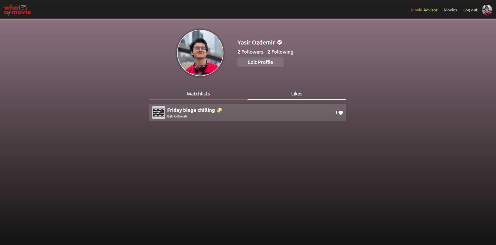

<h1 align="center">What ai Movie Frontend</h1>

  <a href="#dart-project-summary">Project Summary</a> &#xa0; | &#xa0;
  <a href="#rocket-technologies">Technologies</a> &#xa0; | &#xa0;
  <a href="#camera-images">Images</a> &#xa0; | &#xa0;
  <a href="#bust_in_silhouette-author">Author</a>

## :dart: Project Summary

- [Presentation](https://youtu.be/_rA3CapbmYA?si=ExtdfMh6uaEFnATS)
- [Live Frontend](https://what-ai-movie.vercel.app)
- [Backend Repo](https://github.com/yasirozdemir/capstone-project-be)

- What ai Movie is a web app where users can search for movies depending on their feeling, thoughts, or desires. It uses OpenAI for movie suggestions. The user can create watchlists with the people who follow them. Check the documentation for more.

## :camera: Images

## :open_file_folder: Documentation

- [API Documentation (Postman)](https://documenter.getpostman.com/view/25420267/2s93eU3Zqs)

## :rocket: Technologies

Technologies & Tools:

- [React](https://react.dev/)
- [Redux](https://redux.js.org/)
- [TypeScript](https://www.typescriptlang.org/)
- [Bootstrap](https://getbootstrap.com/)

Packages:

- [date-fns](https://www.npmjs.com/package/date-fns)
- [react-router-dom](https://www.npmjs.com/package/react-router-dom)
- [react-icons](https://www.npmjs.com/package/react-icons)
- [react-loader-spinner](https://www.npmjs.com/package/react-loader-spinner)
- [react-toastify](https://www.npmjs.com/package/react-toastify)
- [typewritter-effect](https://www.npmjs.com/package/typewriter-effect)
- Check _package.json_ for more

## :bust_in_silhouette: Author

- [Personal Portfolio](https://www.yasirozdemir.com/)
- [LinkedIn](https://www.linkedin.com/in/muhammedyasirozdemir/)
- [Github](https://github.com/yasirozdemir)
